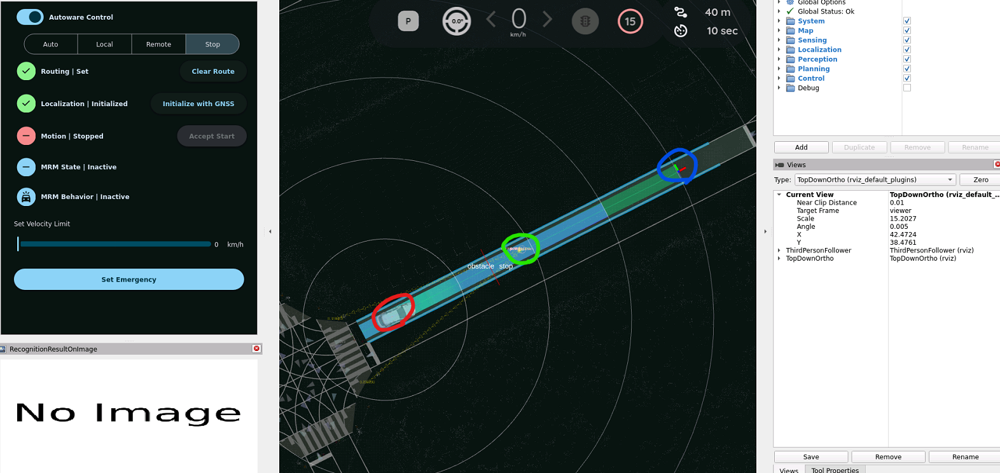
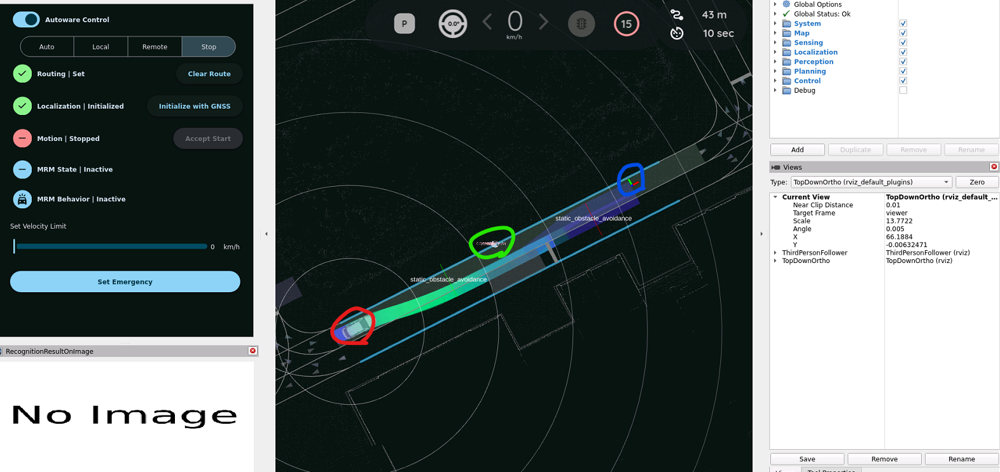

# Autoware Partition KATECH 가이드

> Version 1.4 | 2026.07.29

## 1. Overview

이 문서는 Autoware를 기능별 파티션으로 분리하여 Docker 컨테이너로 빌드하고, Planning Simulation의 Lane Driving 시나리오를 실행하는 방법을 다룹니다. 기존 GOASP Autoware Partition 가이드의 설계 방향을 기반으로 하되, KATECH에서 수정한 소스와 PC·ARM64 BSP 보드 시험 결과를 현재 절차에 반영했습니다.

이 문서의 주요 목적은 다음과 같습니다.

- Autoware 모듈화: 기능별 역할을 세 파티션으로 분리하고 독립적인 이미지로 구성합니다.
- 재현 가능한 배포: 공개 Git 저장소, Docker 이미지와 맵 경로를 기준으로 실행 절차를 통일합니다.
- BSP 보드와 외부 PC 연동: ARM64 BSP 보드에서 Autoware를 실행하고 AMD64 PC에서 RViz2로 시각화·조작합니다.
- No-CUDA 기준: 현재 검증 범위에서 CUDA 이미지와 NVIDIA runtime을 제외합니다.

| 항목 | 현재 기준 |
| --- | --- |
| Autoware | Autoware Universe 0.41.2 기반 KATECH 파티션 버전 |
| ROS / OS | ROS 2 Humble / Ubuntu 22.04 Jammy |
| 지원 아키텍처 | linux/amd64, linux/arm64 |
| 실행 시나리오 | Planning Simulation - Lane Driving |
| GPU 정책 | No-CUDA 빌드 및 실행 |

표 1. 문서 적용 범위

> 현재 배포 기준 CUDA 빌드와 CUDA 실행은 BSP 보드에서의 RViz 및 runtime 차이를 줄이기 위해 사용하지 않습니다. 이미지 빌드에는 --no-cuda, 수동 실행에는 --no-nvidia를 사용합니다.

## 2. Partitioning Approach

Autoware는 Map, Localization, Sensing, Perception, Planning, Control, System 등의 기능 컴포넌트 아래에 다수의 ROS 2 패키지와 노드가 구성되고 topic과 service로 연결된 구조입니다. 현재 구현은 기능적으로 연관된 컴포넌트를 Perception, Decision, Control의 세 Docker 파티션으로 묶는 컴포넌트 기반 파티셔닝을 사용합니다.

### 2.1 컴포넌트 기반 파티셔닝

컴포넌트 기반 파티셔닝은 Map, Perception, Planning, Control과 같은 기능 영역을 기준으로 배포 경계를 정하는 방식입니다. 이 프로젝트에서는 partition/partition_config/*.json의 folders 목록으로 각 파티션에 포함할 컴포넌트 소스 범위를 정의합니다.

JSON의 packages 목록은 컴포넌트 경계 밖에서 필요한 공통 launch, 설정과 빌드·실행 의존 패키지를 보완합니다. 빌드 스크립트는 packages의 package.xml 경로와 folders의 전체 소스 범위를 함께 Dockerfile에 반영하고, rosdep으로 build/exec dependency를 설치합니다.

장점

- 기능적으로 연관된 컴포넌트를 한 파티션으로 묶어 역할과 배포 경계를 이해하기 쉽습니다.
- 파티션별 컴포넌트 폴더와 보완 패키지가 JSON으로 명시되어 변경 내용을 추적하기 쉽습니다.
- Planning Simulation에 필요한 기능 영역을 유지하면서 파티션별 이미지를 독립적으로 빌드하고 실행할 수 있습니다.

유의사항

- folders에 지정한 컴포넌트 디렉터리 아래의 ROS 2 패키지는 개별 packages 목록과 관계없이 함께 포함됩니다.
- 공통 launch, config와 실행 의존성 때문에 일부 보조 패키지가 여러 이미지에 포함될 수 있습니다. 이미지에 같은 패키지가 포함되는 것과 같은 노드가 중복 실행되는 것은 구분해야 합니다.
- 컴포넌트 폴더 또는 보완 패키지 목록이 변경되면 세 파티션 이미지와 Lane Driving 시나리오를 다시 검증해야 합니다.

현재 적용 방식

- Docker 활용: 장비에 Autoware가 별도로 설치되어 있어도 컨테이너의 패키지 환경을 유지합니다.
- 공통 base 재사용: ROS 2와 공통 의존성을 base 이미지에 구성하여 중복 빌드를 줄입니다.
- 순차 실행: Perception, Decision, Control 순서와 기본 10초 간격을 적용합니다.
- 통신 분리: 기본 ROS_DOMAIN_ID 42를 사용하여 host의 다른 ROS 환경과 분리합니다.

## 3. 파티셔닝 구현

### 3.1 파티션 구성

Planning Simulation 시나리오를 기준으로 Autoware 기능을 Perception, Decision, Control의 세 파티션으로 구성합니다.

| Perception Part | Decision Part | Control Part |
| --- | --- | --- |
| Perception<br>Sensing<br>Localization<br>Map<br>RViz2 | Planning<br>System | Control<br>Vehicle Interface<br>Simulator<br>AD API |

그림 1. KATECH Autoware 파티션 구성

| 파티션 | 주요 역할 | 컨테이너 시작 스크립트 |
| --- | --- | --- |
| Perception | Map, Localization, Sensing, Perception, RViz2 | adsw-perception.sh |
| Decision | Planning, System, route 및 trajectory 생성 | adsw-decision.sh |
| Control | Control, Vehicle, Simulator, AD API | adsw-control.sh |

표 2. 파티션별 역할

RViz2 실행 파일과 설정은 Perception 이미지에 포함되지만, 권장 구성에서는 BSP 보드가 아니라 외부 PC에서 해당 이미지를 사용해 RViz2만 실행합니다.

파티션 구성은 아래 JSON 파일에서 관리합니다.

```text
partition/partition_config/sample-adsw-perception.json
partition/partition_config/sample-adsw-decision.json
partition/partition_config/sample-adsw-control.json
```

각 JSON의 folders에는 파티션을 구성하는 컴포넌트 소스 범위를, packages에는 범위 밖에서 필요한 보완 의존 패키지를 정의합니다. 빌드 스크립트는 두 정보를 Dockerfile.template에 반영합니다.

### 3.2 Docker 이미지 구성

| 단계 | 입력 | 출력 및 역할 |
| --- | --- | --- |
| 1. Base | ros:humble-ros-base-jammy | 공통 OS, ROS 2, 도구와 entrypoint |
| 2. Dependency | core, common, partition JSON | rosdep build/exec 패키지 목록 |
| 3. Development | 파티션별 소스 | /opt/autoware 빌드 결과 |
| 4. Runtime | base + install 결과 | 최종 Perception/Decision/Control 이미지 |

그림 2. Docker 이미지 생성 흐름

Base 이미지의 핵심 구조는 다음과 같습니다.

```text
ARG BASE_IMAGE
FROM $BASE_IMAGE AS base
SHELL ["/bin/bash", "-o", "pipefail", "-c"]

COPY setup-dev-env.sh ansible-galaxy-requirements.yaml /autoware/
COPY ansible/ /autoware/ansible/
COPY partition/start_script/ /autoware/start_script/

WORKDIR /autoware
ENTRYPOINT ["/ros_entrypoint.sh"]
```

partition_build.sh는 빌드 시 BASE_IMAGE, AUTOWARE_BASE_IMAGE와 target을 전달합니다. Dockerfile의 FROM 앞 ARG 기본값이 비어 있다는 정적 검사 경고는 실제 빌드 인자가 전달되어 다음 단계가 진행된다면 단독으로 실패 원인이 아닙니다.

### 3.3 의존성 해결

컴포넌트 폴더에 포함된 패키지와 보완 packages의 package.xml에 선언된 build/exec dependency는 rosdep으로 계산합니다. 다만 기존 Autoware 통합 launch가 암묵적으로 사용하는 설정 파일과 launch dependency는 빌드 단계에서 검출되지 않을 수 있습니다.

1. 빌드 오류에서 누락된 ROS 2 패키지와 package.xml 의존성을 확인합니다.
2. launch 파일이 다른 패키지의 config, parameter, URDF를 참조하는지 확인합니다.
3. DDS로 다른 파티션에서 받을 수 있는 기능인지, 로컬 파일이 꼭 필요한지 구분합니다.
4. 기능 경계를 바꿔야 하면 folders를 조정하고, 누락된 의존성만 packages 또는 obigo_launch에 추가합니다.
5. 세 이미지를 다시 빌드하고 Lane Driving 시나리오를 검증합니다.

> 의존성 추가 원칙 패키지를 무작정 여러 파티션에 추가하면 이미지 크기가 증가하고 독립성이 낮아집니다. 노드 실행 의존성과 설정 파일 의존성을 구분하여 최소 범위만 추가합니다.

### 3.4 파티션별 런처와 통신

기존 autoware_launch 하나를 모든 컨테이너에서 실행하지 않고, obigo_launch의 파티션별 launch를 시작 스크립트에서 호출합니다.

| 순서 | 파티션 | Launch | 기본 대기 |
| --- | --- | --- | --- |
| 1 | Perception | sample_adsw_perception_run.launch.xml | - |
| 2 | Decision | sample_adsw_decision_run.launch.xml | 10초 |
| 3 | Control | sample_adsw_control_run.launch.xml | 10초 |

표 3. 파티션 실행 순서

| 설정 | 목적 |
| --- | --- |
| ROS_DOMAIN_ID=42 | Host의 다른 ROS 2/Autoware 노드와 domain 분리 |
| --net=host | 파티션 사이 ROS 2 DDS 통신 |
| --pid=host, --ipc=host | 프로세스 이름 및 IPC 환경 일관성 유지 |
| 동일 map mount | 모든 파티션에서 /autoware_map 참조 |

표 4. 컨테이너 통신 설정

## 4. 소스 및 데이터 준비

### 4.1 개발 환경

Host는 Ubuntu 22.04를 기준으로 하며 Docker Engine과 Buildx가 필요합니다.

Docker 설치 안내: [Docker Engine for Ubuntu](https://docs.docker.com/engine/install/ubuntu/)

| 환경 | 아키텍처 | 검증 기준 |
| --- | --- | --- |
| 일반 PC | x86_64 / linux/amd64 | Ubuntu 22.04, No-CUDA |
| ARM64 BSP 보드 | aarch64 / linux/arm64 | Ubuntu 22.04, 62 GiB RAM, No-CUDA |

표 5. 현재 검증 환경

```bash
sudo apt update
sudo apt install -y git git-lfs python3-vcstool python3-pip jq unzip x11-xserver-utils
git lfs install
python3 -m pip install --user gdown
docker --version
docker buildx version
docker run --rm hello-world
```

Docker 권한 오류가 발생하면 현재 사용자를 docker 그룹에 추가한 뒤 다시 로그인합니다.

```bash
sudo usermod -aG docker "$USER"
```

### 4.2 소스 코드 받기

```bash
mkdir -p "$HOME/oss"
cd "$HOME/oss"
git clone https://github.com/OSS-TEST-GROUP/katech-autoware.git oss_adsw
cd "$HOME/oss/oss_adsw"
git lfs pull
```

| 구분 | 저장소 | 브랜치 |
| --- | --- | --- |
| 상위 저장소 | github.com/OSS-TEST-GROUP/katech-autoware | main |
| Autoware Universe | github.com/OSS-TEST-GROUP/katech-autoware-universe | main |

표 6. 공개 소스 저장소

Autoware 저장소에서 가져오는 autoware.repos 항목은 다음과 같습니다.

```yaml
universe/autoware.universe:
type: git
url: https://github.com/OSS-TEST-GROUP/katech-autoware-universe.git
version: main
```

### 4.3 맵 데이터 준비

Planning Simulation에는 sample-map-planning 맵 데이터를 사용합니다.

다운로드: [sample-map-planning.zip](https://docs.google.com/uc?export=download&id=1499_nsbUbIeturZaDj7jhUownh5fvXHd)

```bash
mkdir -p "$HOME/autoware_map"
python3 -m gdown \
-O "$HOME/autoware_map/sample-map-planning.zip" \
'https://docs.google.com/uc?export=download&id=1499_nsbUbIeturZaDj7jhUownh5fvXHd'
unzip -o "$HOME/autoware_map/sample-map-planning.zip" \
-d "$HOME/autoware_map"
MAP_PATH="$HOME/autoware_map/sample-map-planning"
ls -al "$MAP_PATH"
```

맵 폴더에는 최소한 다음 파일이 있어야 합니다.

```text
lanelet2_map.osm
pointcloud_map.pcd
map_projector_info.yaml
map_config.yaml
```

## 5. Docker 이미지 준비

사전 빌드 이미지를 받거나 현재 소스로 직접 빌드하는 방법 중 하나를 선택합니다.

### 5.1 사전 빌드 이미지

GitHub Container Registry(GHCR)의 공개 기본 태그는 linux/amd64와 linux/arm64
manifest를 함께 포함합니다. Docker가 host 아키텍처에 맞는 이미지를 자동으로
선택하므로 아키텍처 접미사나 재태깅이 필요하지 않습니다.

```bash
REPO=ghcr.io/oss-test-group/autoware-partition
docker pull "${REPO}:adsw-perception"
docker pull "${REPO}:adsw-decision"
docker pull "${REPO}:adsw-control"
docker image inspect "${REPO}:adsw-perception" \
--format '{{.Os}}/{{.Architecture}}'
```

| 이미지 | 지원 플랫폼 |
| --- | --- |
| adsw-perception | linux/amd64, linux/arm64 |
| adsw-decision | linux/amd64, linux/arm64 |
| adsw-control | linux/amd64, linux/arm64 |

표 7. 사전 빌드 이미지

### 5.2 소스에서 직접 빌드

현재 host 아키텍처를 확인하고 플랫폼을 선택합니다.

```bash
uname -m
# x86_64 PC
PLATFORM=linux/amd64
# aarch64 보드
# PLATFORM=linux/arm64
```

No-CUDA 이미지 세 개를 빌드합니다.

```bash
cd "$HOME/oss/oss_adsw"
REPO=ghcr.io/oss-test-group/autoware-partition
./partition/partition_build.sh \
--repo "$REPO" \
--platform "$PLATFORM" \
--no-cuda
docker images "$REPO"
```

생성되는 주요 태그는 다음과 같습니다.

```text
ghcr.io/oss-test-group/autoware-partition:adsw-perception
ghcr.io/oss-test-group/autoware-partition:adsw-decision
ghcr.io/oss-test-group/autoware-partition:adsw-control
```

파티션 설정 파일과 Docker build target의 내부 이름은 기존
`sample-adsw-*`를 유지합니다. `partition_build.sh`는 이미지를 저장할 때만 선행
`sample-`을 제거하므로 로컬 빌드와 Registry 배포 모두 위 `adsw-*` 태그를
사용합니다.

ARM64 이미지는 ARM64 BSP 보드에서, AMD64 이미지는 x86_64 PC에서 네이티브 빌드하는 방식을 권장합니다. QEMU 교차 빌드는 가능하지만 빌드 시간이 길고 메모리 사용량이 증가합니다.

## 6. 파티션 실행

기본 권장 구성은 BSP 보드에서 Autoware 파티션을 실행하고 외부 PC에서 RViz2로 시각화·조작하는 방식입니다. 외부 PC와 ROS 2 통신이 되지 않거나 통신 문제와 Autoware 자체 문제를 분리해야 할 때만 BSP 보드에 Ubuntu Desktop을 설치하여 RViz를 같은 장비에서 실행합니다.

### 6.1 권장 구성 - BSP 보드와 외부 PC RViz

BSP 보드에서는 Perception, Decision, Control만 실행하고 RViz는 시작하지 않습니다. 외부 PC는 동일한 Perception 이미지를 사용해 RViz2와 Autoware 전용 RViz 플러그인만 실행합니다. 초기 pose, goal과 Auto 조작은 외부 PC의 RViz에서 수행하며 ROS 2 네트워크를 통해 BSP 보드로 전달됩니다.

> 검증 완료 ARM64 BSP 보드에서 세 파티션을 실행하고 AMD64 Ubuntu Desktop PC에서 RViz2만 실행하는 구성을 검증했습니다. 외부 PC는 Autoware 소스 빌드, ROS 2 직접 설치 및 맵 데이터가 필요하지 않으며 Docker가 PC 아키텍처에 맞는 이미지를 자동으로 선택합니다.

| 장비 | 실행 내용 | 필수 환경 |
| --- | --- | --- |
| BSP 보드 | 세 Autoware 파티션, RViz 비활성화 | Ubuntu 22.04, Docker, 맵 데이터 |
| 외부 PC | RViz2 전용 컨테이너 | Ubuntu Desktop, Docker, X11/Display |

표 8. BSP 보드 원격 RViz 구성

네트워크 조건

- BSP 보드와 외부 PC는 서로 ping이 가능한 동일 LAN에 연결합니다.
- BSP 보드와 외부 PC 실행 명령에 같은 --domain-id 값을 사용합니다. 이 가이드에서는 42를 사용합니다.
- ROS 2 네트워크 통신에 필요한 내부 설정은 실행 스크립트가 자동으로 적용하므로 별도 환경변수를 설정할 필요가 없습니다.
- PointCloud2와 marker 전송량이 크므로 가능한 한 1 Gbps 유선 네트워크를 사용합니다.
- 두 장비의 파티션 이미지 버전을 동일하게 맞춥니다.

#### 6.1.1 BSP 보드 실행

BSP 보드에는 ubuntu-desktop, X11 또는 DISPLAY가 필요하지 않습니다. 통합 실행 명령에 --headless를 추가하여 Autoware 파티션만 실행합니다.

```bash
cd "$HOME/oss/oss_adsw"
REPO=ghcr.io/oss-test-group/autoware-partition
MAP_PATH="$HOME/autoware_map/sample-map-planning"
./partition/run_partitions.sh --repo "$REPO" --map-path "$MAP_PATH" --domain-id 42 --headless
```

이 명령은 Perception launch에 rviz:=false를 전달합니다. Perception, Decision, Control 노드와 로그 동작은 일반 실행과 동일합니다.

#### 6.1.2 외부 PC에서 RViz 실행

외부 PC는 Desktop GUI 세션에서 저장소와 Perception 이미지를 준비한 뒤 다음 명령을 실행합니다. 외부 PC에 ROS 2나 Autoware를 직접 설치할 필요는 없습니다.

```bash
cd "$HOME/oss/oss_adsw"
REPO=ghcr.io/oss-test-group/autoware-partition
docker pull "${REPO}:adsw-perception"
./partition/run_remote_rviz.sh --repo "$REPO" --domain-id 42
```

RViz가 실행되면 BSP 보드에서 발행하는 map, TF, route, trajectory와 vehicle 상태가 표시됩니다. 외부 PC의 RViz에서 지정한 initial pose와 goal도 같은 ROS domain을 통해 BSP 보드로 전달됩니다.

#### 6.1.3 통합 검증 순서

실제 장비에서는 다음 순서로 BSP 보드 실행과 외부 PC 원격 시각화를 확인합니다.

1. 기존 Autoware 컨테이너를 종료하고 BSP 보드와 외부 PC가 서로 ping 되는지 확인합니다.

2. BSP 보드에서 6.1.1의 --headless 명령을 실행하고 adsw-perception-42, adsw-decision-42, adsw-control-42 컨테이너가 실행되는지 확인합니다.

3. 외부 PC의 GUI 터미널에서 6.1.2의 run_remote_rviz.sh를 실행합니다. 처음 실행하면 AMD64 Perception 이미지가 자동으로 내려받아집니다.

4. RViz에서 pointcloud map, vector map이 표시되는지 확인합니다.

5. 2D Pose Estimate와 2D Goal Pose를 지정하여 route가 생성되고 Auto 조작이 BSP 보드로 전달되는지 확인합니다.

6. 종료할 때 외부 PC의 RViz와 BSP 보드 실행 터미널에서 각각 Ctrl-C를 누릅니다.

```bash
# BSP 보드: 세 파티션 확인
docker ps --filter 'name=adsw-'
# 외부 PC: 원격 RViz 컨테이너에서 topic 확인
docker exec -it adsw-remote-rviz-42 bash -lc 'source /opt/ros/humble/setup.bash && source /opt/autoware/setup.bash && ros2 topic list | head -n 30'
```

### 6.2 대체 확인 방법 - BSP 보드에서 Autoware와 RViz 함께 실행

외부 PC와 ROS 2 통신이 되지 않거나 네트워크 문제와 Autoware·RViz 자체 문제를 분리해야 할 때 사용하는 대체 확인 방법입니다. BSP 설치 가이드에 따라 구성한 기본 보드에는 Ubuntu Desktop이 없으므로, 보드에서 직접 RViz를 확인하려면 먼저 Ubuntu Desktop을 설치해야 합니다.

#### 6.2.1 Ubuntu Desktop 설치

BSP 제공사에서 별도의 Desktop 설치 절차를 제공하면 해당 절차를 우선 적용합니다. 별도 절차가 없는 Ubuntu 22.04 환경에서는 다음 명령으로 설치합니다.

```bash
sudo apt update
sudo apt install -y ubuntu-desktop
sudo systemctl set-default graphical.target
sudo reboot
```

설치 중 display manager 선택 화면이 나오면 BSP 제공사가 권장하는 항목을 선택합니다. 재부팅 후 BSP 보드의 GUI 화면에서 로그인하고, 터미널에서 echo "$DISPLAY" 결과가 비어 있지 않은지 확인합니다.

#### 6.2.2 BSP 보드에서 Autoware와 RViz 실행

```bash
echo "$DISPLAY"
cd "$HOME/oss/oss_adsw"
REPO=ghcr.io/oss-test-group/autoware-partition
MAP_PATH="$HOME/autoware_map/sample-map-planning"
./partition/run_partitions.sh \
--repo "$REPO" \
--map-path "$MAP_PATH" \
--domain-id 42
```

직접 빌드한 이미지도 같은 `ghcr.io/oss-test-group/autoware-partition` repository 이름을 사용합니다. 스크립트는 Perception → 10초 → Decision → 10초 → Control 순서로 실행하고 세 로그를 현재 터미널에 출력합니다.

BSP 보드에서 초기화가 느리면 파티션 시작 간격을 늘릴 수 있습니다.

```bash
./partition/run_partitions.sh \
--repo "$REPO" \
--map-path "$MAP_PATH" \
--domain-id 42 \
--delay 20
```

### 6.3 로그·종료·재실행

로그 폴더는 스크립트가 자동으로 생성합니다. 컨테이너 내부에서는 /workspace/log, host에서는 저장소의 log/ 폴더입니다.

```bash
log/perception_log.txt
log/decision_log.txt
log/control_log.txt
tail -F log/perception_log.txt \
log/decision_log.txt \
log/control_log.txt
docker ps --filter 'name=adsw-'
```

실행 터미널에서 Ctrl-C를 누르면 세 컨테이너가 함께 종료됩니다. 다시 실행할 때는 동일한 run_partitions.sh 명령을 사용합니다. 비정상 종료로 같은 이름의 컨테이너가 남아 있어도 스크립트가 제거한 뒤 새로 시작합니다.

### 6.4 파티션별 수동 실행

개별 파티션을 확인할 때만 세 터미널에서 다음 명령을 각각 실행합니다.

```bash
# Terminal 1 - Perception
ROS_DOMAIN_ID=42 ./partition/partition_run.sh --rm --no-nvidia \
--repo "$REPO" --tag adsw-perception --map-path "$MAP_PATH" \
/autoware/start_script/adsw-perception.sh
# Terminal 2 - Decision
ROS_DOMAIN_ID=42 ./partition/partition_run.sh --rm --no-nvidia \
--repo "$REPO" --tag adsw-decision --map-path "$MAP_PATH" \
/autoware/start_script/adsw-decision.sh
# Terminal 3 - Control
ROS_DOMAIN_ID=42 ./partition/partition_run.sh --rm --no-nvidia \
--repo "$REPO" --tag adsw-control --map-path "$MAP_PATH" \
/autoware/start_script/adsw-control.sh
```

> Domain 일치 세 명령은 반드시 같은 ROS_DOMAIN_ID를 사용해야 합니다. host에서 다른 Autoware가 실행 중이면 다른 domain을 사용하거나 해당 노드를 종료합니다.

## 7. Planning Simulation 테스트

세 파티션의 초기화가 완료된 뒤 외부 PC의 RViz에서 다음 순서로 검증합니다. BSP 보드에서 RViz를 직접 실행하는 대체 확인 방법에서도 절차는 동일합니다.

1. Pointcloud map과 vector map이 정상적으로 보이는지 확인합니다.

2. 2D Pose Estimate로 차선 위에 초기 위치와 차량 방향을 지정합니다.

3. Localization과 planning 초기화가 안정될 때까지 기다립니다.

4. 2D Goal Pose로 연결된 차선 위에 목표 위치와 방향을 지정합니다.

5. Route와 trajectory가 표시되는지 확인합니다.

6. Auto 버튼이 활성화되면 눌러 주행을 시작합니다.

7. 차량이 차선을 따라 목표 지점에 도착하는지 확인합니다.

| 확인 항목 | 정상 기준 | 주요 로그 |
| --- | --- | --- |
| Map / Localization | 지도 표시 및 pose 적용 | perception_log.txt |
| Route / Planning | route와 trajectory 생성 | decision_log.txt |
| Control / Simulator | Auto 활성화 및 차량 이동 | control_log.txt |

표 9. 시나리오 검증 기준

ARM64 BSP 보드는 PC보다 map, localization, planning 초기화가 오래 걸릴 수 있습니다. Auto가 즉시 활성화되지 않으면 pose를 연속해서 다시 지정하기보다 각 파티션 로그가 안정될 때까지 기다립니다.

### 7.1 주행 및 장애물 대응 검증

기존 katech-partition 구성에서 RViz로 장애물을 배치하여 다음 주행 시나리오를 검증했습니다.

1. Initial Pose와 Goal Pose를 설정한 후 route와 trajectory가 생성되고, 차량이 목적지까지 주행하는 것을 확인했습니다.

2. 주행 경로 중간에 장애물을 배치하면 차량이 장애물 앞에서 정지하고, 장애물을 제거하면 다시 출발하는 것을 확인했습니다.

3. 장애물이 주행 경로에서 일부 벗어난 위치에 있는 경우 local path와 trajectory가 장애물 반대쪽으로 변경되고, 차량이 이를 따라 주행하는 것을 확인했습니다.

장애물에 대한 정지 또는 회피 판단은 장애물의 위치, 차선 구조와 주변 주행 가능 공간에 따라 달라질 수 있습니다.

#### 7.1.1 공통 준비

아래 두 시험은 서로 독립적으로 수행합니다. 각 시험을 시작하기 전에 이전 시험에서 생성한 장애물을 모두 삭제합니다.

1. 6장의 실행 방법에 따라 Perception, Decision, Control 파티션과 RViz를 실행합니다.

2. pointcloud map과 vector map이 표시되고 각 파티션의 초기화 로그가 안정될 때까지 기다립니다.

3. RViz에서 Initial Pose와 Goal Pose를 지정하고 route와 trajectory가 생성되는지 확인한 뒤 Auto 주행을 시작합니다.

4. RViz 도구 모음의 Delete All Objects를 눌러 기존 더미 객체가 남아 있지 않은지 확인합니다.

#### 7.1.2 경로상 장애물 정지 및 재출발



( 빨간원 : pose estimate, 파란원 : goal pose, 녹색원 : 2D Dummy Pedestrian )

1. 차량 전방 직선 주행 구간을 선택합니다.

2. RViz 도구 모음에서 Pedestrian Dummy를 선택합니다. 이 도구로 생성되는 보행자의 기본 속도는 0입니다.

3. 차량이 Auto로 주행 중일 때 route 중심을 클릭하여 장애물을 배치합니다.

4. 장애물이 화면에 표시된 뒤 차량이 감속하고 장애물 앞에서 충돌 없이 완전히 정지하는지 확인합니다.

5. 정지 상태를 2~3초간 확인한 후 RViz 도구 모음에서 Delete All Objects를 눌러 장애물을 제거합니다.

6. Goal Pose를 다시 지정하거나 Auto를 다시 누르지 않아도 차량이 출발하여 기존 경로를 계속 주행하는지 확인합니다.

정상 판정: 차량이 보행자 앞에서 정지하고, 보행자를 제거하면 자동으로 재출발해야 합니다. 장애물을 차량 바로 앞에 생성하면 긴급 정지가 발생할 수 있으므로 충분한 거리를 두고 다시 시험합니다.

#### 7.1.3 경로 인접 장애물 회피 주행



( 빨간원 : pose estimate, 파란원 : goal pose, 녹색원 : 2D Dummy Pedestrian )

1. 교차로, 급커브, 차선 끝과 대향 차선 경계를 피하고 차량 전방 폭이 충분한 직선 구간을 선택합니다.

2. RViz 도구 모음에서 보행자 도구를 선택합니다. 이 도구로 생성되는 보행자의 기본 속도는 0입니다.

3. 보행자가 경로 중간 지점 차선 경계에 걸치도록 배치합니다.

※ 차량이 회피하여 주행할 수 있을 만한 여유 거리가 되는 위치에 배치해야 합니다.

4. 객체가 인식될 때까지 2~3초 기다린 후 global route는 유지되면서 장애물 반대쪽으로 local path와 trajectory가 휘는지 확인합니다.

5. 차량이 변경된 trajectory를 따라 보행자를 통과하고 주행하는지 확인합니다.

정상 판정: 장애물을 유지한 상태에서 local path와 trajectory가 장애물 반대쪽으로 변경되고 차량이 이를 따라 주행해야 합니다.

## 8. 문제 해결

### 8.1 SSH agent 오류

```text
invalid empty ssh agent socket: make sure SSH_AUTH_SOCK is set
```

현재 빌드 스크립트는 유효한 SSH_AUTH_SOCK이 있을 때만 BuildKit SSH forwarding을 사용하고, socket이 없으면 해당 옵션을 생략합니다. 공개 저장소만 사용하는 환경에서는 SSH key를 새로 만들 필요가 없습니다.

### 8.2 Dockerfile ARG 경고

```text
InvalidDefaultArgInFrom:
Default value for ARG $BASE_IMAGE results in empty or invalid base image name
```

Dockerfile의 FROM 앞 ARG에 기본값이 없어 정적 검사에서 표시되는 경고입니다. partition_build.sh가 BASE_IMAGE와 AUTOWARE_BASE_IMAGE를 전달하고 다음 빌드 단계가 진행된다면 이 경고만으로는 실패가 아닙니다. 마지막 ERROR와 실패한 Dockerfile 줄을 기준으로 원인을 확인합니다.

### 8.3 빌드 중 OOM

```bash
free -h
swapon --show
sudo dmesg -T | grep -i -E 'out of memory|killed process'
```

현재 colcon과 CMake 병렬 작업 수의 기본값은 각각 2입니다. OOM이 반복되면 불필요한 프로세스와 컨테이너를 종료하고 swap과 디스크 공간을 확보한 뒤 다시 빌드합니다. 병렬도 2를 1로 낮추면 작업 수가 줄지만 전체 빌드 시간이 정확히 두 배가 되는 것은 아닙니다.

### 8.4 이미지 pull 권한 오류

```text
pull access denied
insufficient_scope: authorization failed
```

REPO와 태그를 확인합니다. 공개 배포 repository는 `ghcr.io/oss-test-group/autoware-partition`입니다. 직접 빌드 중 `cuda-latest`를 찾는 오류가 발생하면 CUDA 대상이 선택된 것이므로 `--no-cuda`를 사용합니다.

### 8.5 Route 또는 Auto 버튼 비활성화

```text
grep -i -E 'error|route|trajectory|50001' \
log/decision_log.txt | tail -100
```

Decision에서 trajectory가 생성되지 않으면 Control의 timeout이 후속 증상으로 나타날 수 있습니다. Perception, Decision, Control 순서와 초기화 완료 여부를 먼저 확인하고, BSP 보드에서는 필요하면 --delay 20을 사용합니다.

### 8.6 중복 노드

```bash
docker exec adsw-decision-42 bash -lc \
'source /opt/autoware/setup.bash && ros2 node list | sort | uniq -d'
```

중복이 보이면 같은 ROS_DOMAIN_ID에서 실행 중인 다른 컨테이너, host ROS 2 노드 또는 이전 수동 실행을 확인합니다. 여러 이미지에 같은 의존 패키지가 포함된 것과 동일 노드가 실제로 두 번 실행되는 것은 구분해야 합니다.

### 8.7 BSP 보드 로컬 RViz Bus error

외부 PC와 통신할 수 없어 BSP 보드에 Ubuntu Desktop을 설치하고 RViz를 직접 실행하는 대체 확인 과정에서 특정 vector map marker display가 Bus error로 종료된 사례가 있습니다. 기본 RViz가 실행되고 특정 marker 설정에서만 죽는다면 전체 보드 성능 부족으로 단정하지 말고 map visualization의 ARM64 호환 문제를 분리하여 확인합니다.

- RViz 기본 창과 최소 설정이 정상적으로 실행되는지 확인합니다.
- vector_map_marker 또는 map display를 추가하는 시점에 오류가 발생하는지 확인합니다.
- Perception 로그의 map loader와 marker publisher 상태를 확인합니다.
- 현재 배포는 CUDA 및 NVIDIA runtime 차이를 제거하기 위해 No-CUDA로 통일합니다.

### 8.8 외부 PC RViz에서 topic이 보이지 않음

BSP 보드의 컨테이너가 정상인데 외부 PC RViz에서 map이나 TF가 보이지 않으면 다음 순서로 확인합니다.

1. BSP 보드와 외부 PC가 서로 ping 되는지 확인합니다.

2. 두 장비가 같은 ROS_DOMAIN_ID를 사용하는지 확인합니다.

3. BSP 보드의 파티션과 외부 PC의 RViz를 종료한 뒤 동일한 실행 명령으로 다시 시작합니다.

4. 인터페이스가 여러 개면 8.8.1의 방법으로 실제 LAN 인터페이스를 지정합니다.

5. 계속 연결되지 않으면 8.8.2의 UDP multicast 테스트를 수행합니다.

6. UFW 또는 사내 방화벽에서 상대 장비의 UDP 통신을 허용합니다.

#### 8.8.1 네트워크 인터페이스 지정

기본 명령으로 topic이 보이지 않고 유선 LAN, Wi-Fi, Docker bridge 등 인터페이스가 여러 개일 때만 실제 LAN 인터페이스를 확인하여 명시합니다. 두 장비의 인터페이스 이름은 서로 달라도 됩니다.

```bash
# 각 장비에서 LAN 인터페이스 확인
ip -br address
# BSP 보드 예시
./partition/run_partitions.sh --repo "$REPO" --map-path "$MAP_PATH" --domain-id 42 --headless --network-interface eth0
# 외부 PC 예시
./partition/run_remote_rviz.sh --repo "$REPO" --domain-id 42 --network-interface enp3s0
```

#### 8.8.2 UDP multicast 확인

네트워크 인터페이스를 확인한 뒤에도 topic이 보이지 않을 때만 multicast가 두 장비 사이를 통과하는지 검사합니다. 먼저 BSP 보드에서 수신 명령을 실행하고, 그 상태에서 외부 PC의 송신 명령을 실행합니다.

```bash
# BSP 보드
docker exec -it adsw-perception-42 bash -lc 'source /opt/ros/humble/setup.bash && ros2 multicast receive'
# 외부 PC
docker run --rm --net=host "${REPO}:adsw-perception" bash -lc 'source /opt/ros/humble/setup.bash && ros2 multicast send'
```

BSP 보드에 Hello World!가 출력되면 UDP multicast가 전달된 것입니다. 실패하면 두 장비의 방화벽, 스위치/VLAN, Wi-Fi AP의 client isolation과 선택한 네트워크 인터페이스를 확인합니다.
